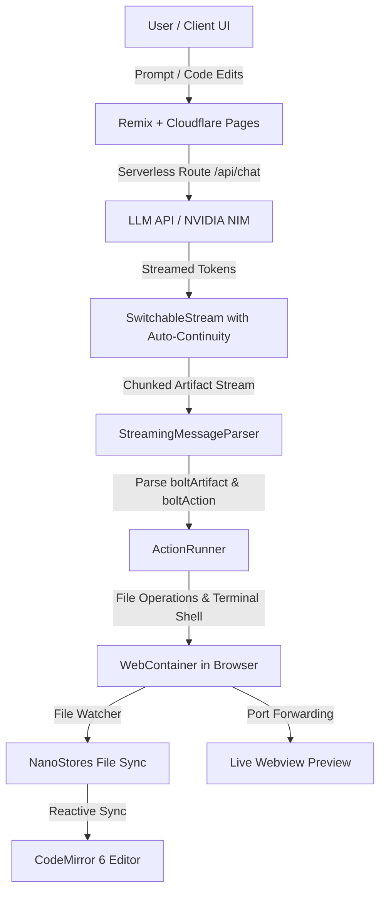
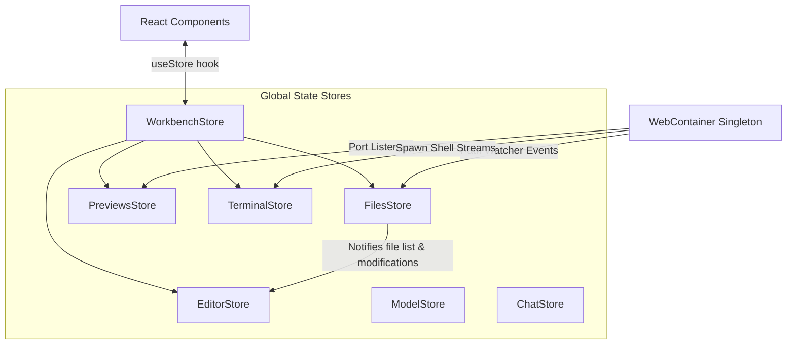

# LS Build / Bolt Architecture, Working Logic & Feature Documentation

---

## 1. Executive Summary & Overview

**LS Build** (built on the Bolt.new open-source foundation) is a full-stack, AI-powered browser-native development environment. It enables developers and users to generate, run, edit, debug, and preview full-stack web applications entirely inside the client's browser without requiring remote virtual machines or backend containers.

### Core Value Proposition
* **Zero-Setup Execution**: Runs a real Node.js environment client-side using StackBlitz **WebContainer** technology.
* **Full Streaming Execution**: Real-time streaming LLM generation that executes actions (file creation, package installation, dev server startup) dynamically as tokens stream in.
* **Bi-directional Editing**: Users can modify code directly in the integrated CodeMirror editor, which syncs back to the virtual file system and updates the AI on next turns with unified diffs.
* **Provider-Agnostic LLM Integration**: Multi-model support with default routing through NVIDIA NIM APIs (Nemotron 3.5, Llama 3.2 Vision, Laguna Coder, etc.) and expandable AI SDK architecture.



---

## 2. Technology Stack

| Domain | Technology / Library | Purpose & Rationale |
| :--- | :--- | :--- |
| **Framework** | [Remix](https://remix.run) (v2) + Vite | Server-side rendering, streaming responses, modern routing, and fast HMR. |
| **Deployment Target** | Cloudflare Pages / Workers | Edge-distributed serverless hosting with low latency. |
| **In-Browser OS** | [@webcontainer/api](https://webcontainer.io/) | Full WebAssembly-based POSIX Node.js runtime inside the browser tab. |
| **State Management** | [Nano Stores](https://github.com/nanostores/nanostores) | Lightweight framework-agnostic atomic state with fine-grained reactivity. |
| **Styling & UI** | [UnoCSS](https://unocss.dev/) + SCSS Modules | High-performance atomic utility CSS engine with custom animations and Radix UI primitives. |
| **Code Editor** | [CodeMirror 6](https://codemirror.net/) | Modular, extensible in-browser code editor supporting TypeScript, JSON, HTML, CSS, Markdown, C++, Python, and themes. |
| **Terminal** | [xterm.js](https://xtermjs.org/) + addons | Interactive VT100 terminal emulation attached to WebContainer shell processes (`jsh`). |
| **LLM Orchestration** | [Vercel AI SDK](https://sdk.vercel.ai/) (`ai`) | Standardized streaming primitives, OpenAI-compatible NVIDIA NIM integration. |
| **Client Storage** | IndexedDB | Local persistence of chat threads, code history, and session state. |
| **Markdown / Visuals** | `react-markdown`, `remark-gfm`, `shiki` | Real-time markdown parsing with syntax-highlighted code blocks. |

---

## 3. Directory Structure & File Map

```
bolt.new-main/
├── app/
│   ├── components/                 # UI components
│   │   ├── chat/                   # AI Chat interface & streaming renderers
│   │   │   ├── Artifact.tsx        # Collapsible artifact action container
│   │   │   ├── AssistantMessage.tsx# Assistant response bubble
│   │   │   ├── BaseChat.tsx        # Primary chat layout & input controls
│   │   │   ├── Chat.client.tsx     # Client chat controller & hook bridge
│   │   │   ├── CodeBlock.tsx       # Shiki-highlighted syntax blocks
│   │   │   ├── Markdown.tsx        # Markdown renderer with custom boltArtifact elements
│   │   │   ├── Messages.client.tsx # Virtualized scrollable message list
│   │   │   ├── ModelSelector.tsx   # Model selection dropdown
│   │   │   ├── SendButton.client.tsx# Animated submit / cancel button
│   │   │   └── UserMessage.tsx     # User message bubble
│   │   ├── editor/                 # CodeMirror integration
│   │   │   └── codemirror/         # Theme configurations, extensions & editor state
│   │   ├── header/                 # Top navbar & navigation headers
│   │   │   ├── Header.tsx          # Main header component
│   │   │   └── HeaderActionButtons.client.tsx # Export, deploy, and workbench toggle buttons
│   │   ├── sidebar/                # Slide-out history sidebar
│   │   │   ├── HistoryItem.tsx     # Chat history item with delete/rename
│   │   │   ├── Menu.client.tsx     # Sidebar container with date binning
│   │   │   └── date-binning.ts     # Today, Yesterday, Last 30 Days grouping
│   │   ├── ui/                     # Generic UI primitives (Buttons, Icons, Dialogs)
│   │   └── workbench/              # Right-hand code & preview panel
│   │       ├── EditorPanel.tsx     # Editor tab management and diff views
│   │       ├── FileBreadcrumb.tsx  # Path navigator breadcrumb
│   │       ├── FileTree.tsx        # Interactive hierarchical file system tree
│   │       ├── PortDropdown.tsx    # Live dev server port selector
│   │       ├── Preview.tsx         # Responsive iframe webview & device toggles
│   │       ├── Workbench.client.tsx# Master workbench controller
│   │       └── terminal/           # Multi-tab xterm.js terminal integration
│   ├── lib/
│   │   ├── .server/                # Server-only logic (Remix server bundle)
│   │   │   └── llm/
│   │   │       ├── api-key.ts      # Cloudflare env / local API key resolver
│   │   │       ├── constants.ts    # Model token limits & defaults
│   │   │       ├── model.ts        # NVIDIA NIM / OpenAI model instances
│   │   │       ├── prompts.ts      # System prompts, artifact grammar, rules
│   │   │       ├── stream-text.ts  # Vercel AI SDK text stream initiator
│   │   │       └── switchable-stream.ts # Auto-continuing token stream handler
│   │   ├── hooks/                  # Custom React hooks
│   │   ├── persistence/            # IndexedDB storage for chat histories
│   │   │   ├── db.ts               # Raw IndexedDB schema and CRUD functions
│   │   │   └── useChatHistory.ts   # React hook for chat loading, URL routing, persistence
│   │   ├── runtime/                # In-stream parsing & execution engine
│   │   │   ├── action-runner.ts    # Sequential file/shell executor inside WebContainer
│   │   │   └── message-parser.ts   # Real-time SAX-style parser for <boltArtifact> tags
│   │   ├── stores/                 # Atomic state stores (Nano Stores)
│   │   │   ├── chat.ts             # Active chat status
│   │   │   ├── editor.ts           # Open documents, unsaved edits, scroll state
│   │   │   ├── files.ts            # WebContainer file tree cache & watcher
│   │   │   ├── model.ts            # Active model selection state
│   │   │   ├── previews.ts         # Live preview port mappings & URLs
│   │   │   ├── settings.ts         # Global user preferences
│   │   │   ├── terminal.ts         # Terminal instances & toggle state
│   │   │   ├── theme.ts            # Dark / Light theme store
│   │   │   └── workbench.ts        # Workbench coordinating facade
│   │   └── webcontainer/           # WebContainer lifecycle & singleton
│   │       ├── auth.client.ts      # WebContainer client authentication
│   │       └── index.ts            # Singleton WebContainer bootstrapper
│   ├── routes/                     # Remix routing table
│   │   ├── _index.tsx              # Landing / New Project chat route
│   │   ├── api.chat.ts             # POST streaming chat action endpoint
│   │   ├── api.enhancer.ts         # POST prompt refinement endpoint
│   │   └── chat.$id.tsx            # Chat conversation permalink route
│   ├── styles/                     # Global styles, variables, index.scss
│   ├── types/                      # TypeScript definitions (actions, artifacts, terminal)
│   └── utils/                      # Helper utilities (diff, logger, buffer, debounce)
├── public/                         # Static assets (favicons, icons, robots.txt)
├── functions/                      # Cloudflare Pages functions runtime binding
├── wrangler.toml                   # Cloudflare Workers configuration
├── vite.config.ts                  # Vite + Remix configuration with polyfills
├── uno.config.ts                   # UnoCSS presets, shortcuts, color palettes
└── package.json                    # Project dependencies and build scripts
```

---

## 4. In-Depth Working Logic & Core Workflows

### 4.1 The Artifact & Action Grammar
The LLM communicates with LS Build via a structured XML protocol embedded inside the stream:

```xml
<boltArtifact id="project-init" title="Create Vite React App">
  <boltAction type="file" filePath="package.json">
    {
      "name": "vite-react-project",
      "scripts": { "dev": "vite" },
      "dependencies": { "react": "^18.2.0" }
    }
  </boltAction>
  <boltAction type="shell">
    npm install
  </boltAction>
  <boltAction type="shell">
    npm run dev
  </boltAction>
</boltArtifact>
```

#### Action Types:
1. **`file`**: Writes or updates the file specified by `filePath`. Subdirectories are recursively created automatically.
2. **`shell`**: Spawns an interactive `jsh` subshell inside WebContainer and executes commands (e.g. `npm i`, `npm run dev`).

---

### 4.2 Streaming Parser (`StreamingMessageParser`)
Located in [`app/lib/runtime/message-parser.ts`](file:///c:/Users/Girish%20Lade/Downloads/bolt.new-main/bolt.new-main/app/lib/runtime/message-parser.ts).

* Operates as an **incremental, non-blocking stream parser**.
* As tokens arrive from the LLM endpoint, it scans the buffer for `<boltArtifact>` and `<boltAction>` tags.
* When an open tag is detected:
  1. Fires `onArtifactOpen` -> Instantiates a new `ArtifactState` and `ActionRunner`.
  2. Replaces the raw XML in the user's Markdown view with an interactive `<div class="__boltArtifact__">` placeholder.
  3. Fires `onActionOpen` -> Queues the action in `pending` status.
* When a closing tag `</boltAction>` is encountered:
  1. Trims and normalizes the action content.
  2. Fires `onActionClose` -> Hands the payload to `ActionRunner.runAction()`.
* When `</boltArtifact>` is encountered:
  1. Fires `onArtifactClose` to finalize the UI artifact box.

```mermaid
sequenceDiagram
    participant LLM as LLM API
    participant Parser as StreamingMessageParser
    participant Workbench as WorkbenchStore
    participant Runner as ActionRunner
    participant WC as WebContainer

    LLM->>Parser: Stream chunk `<boltArtifact id="1" title="Setup">`
    Parser->>Workbench: onArtifactOpen(id, title)
    Workbench->>Runner: Create ActionRunner(webcontainer)
    
    LLM->>Parser: Stream chunk `<boltAction type="file" filePath="app.ts">`
    Parser->>Runner: addAction(fileAction)
    
    LLM->>Parser: Stream chunk `const x = 1;\n</boltAction>`
    Parser->>Runner: onActionClose(fileAction + content)
    Runner->>WC: fs.writeFile("app.ts", content)
    
    LLM->>Parser: Stream chunk `<boltAction type="shell">npm run dev</boltAction>`
    Parser->>Runner: runAction(shellAction)
    Runner->>WC: spawn("jsh", ["-c", "npm run dev"])
    WC-->>Workbench: port "on('port')" event fired
    Workbench->>Workbench: Open Preview on Port 5173
```

---

### 4.3 Action Execution Engine (`ActionRunner`)
Located in [`app/lib/runtime/action-runner.ts`](file:///c:/Users/Girish%20Lade/Downloads/bolt.new-main/bolt.new-main/app/lib/runtime/action-runner.ts).

* **Sequential Execution**: Actions are chained sequentially via a promise queue (`#currentExecutionPromise`).
* **Abort Signal Support**: Each action is attached to an `AbortController`. If a user aborts or a new message arrives, running terminal commands or writes are terminated.
* **Execution Strategies**:
  * **Shell**: Calls `webcontainer.spawn('jsh', ['-c', action.content], { env: { npm_config_yes: true } })`. Standard output is piped to the terminal.
  * **File**: Resolves the dirname, invokes `webcontainer.fs.mkdir(folder, { recursive: true })`, then writes the contents using `webcontainer.fs.writeFile()`.

---

### 4.4 In-Browser Virtualized File System (`FilesStore`)
Located in [`app/lib/stores/files.ts`](file:///c:/Users/Girish%20Lade/Downloads/bolt.new-main/bolt.new-main/app/lib/stores/files.ts).

* Uses WebContainer's `internal.watchPaths` API to monitor all file system mutations inside `/home/project/` (excluding `node_modules` and `.git`).
* Batches watch events using `bufferWatchEvents(100ms)` to prevent UI freezing during bulk file operations (such as `npm install`).
* Automatically decodes binary vs. text files using `istextorbinary` to avoid crashing the CodeMirror text editor.
* Maintains a **Diff Tracker** (`#modifiedFiles`):
  * When a user manually modifies files in the editor, `FilesStore` records the original versus modified versions.
  * When the user submits the next message to the AI, it computes unified git diffs using `computeFileModifications()` and attaches them to the prompt so the LLM has complete context on manual user changes.

---

### 4.5 LLM Streaming & Recursive Continuity (`SwitchableStream`)
Located in [`app/routes/api.chat.ts`](file:///c:/Users/Girish%20Lade/Downloads/bolt.new-main/bolt.new-main/app/routes/api.chat.ts) & [`app/lib/.server/llm/switchable-stream.ts`](file:///c:/Users/Girish%20Lade/Downloads/bolt.new-main/bolt.new-main/app/lib/.server/llm/switchable-stream.ts).

* Large full-stack project generations often exceed maximum model token limits (`max_tokens`).
* When the response finishes with `finishReason === 'length'`, the server intercepts the finish event before terminating the HTTP response.
* It automatically appends the current partial response and appends a hidden user continuation prompt (`CONTINUE_PROMPT`).
* `SwitchableStream` seamlessly redirects the readable stream source to the newly spawned sub-turn stream, allowing smooth multi-segment outputs up to `MAX_RESPONSE_SEGMENTS` without dropping the client connection.

---

### 4.6 Persistence & History Routing
Located in [`app/lib/persistence/db.ts`](file:///c:/Users/Girish%20Lade/Downloads/bolt.new-main/bolt.new-main/app/lib/persistence/db.ts) & [`app/lib/persistence/useChatHistory.ts`](file:///c:/Users/Girish%20Lade/Downloads/bolt.new-main/bolt.new-main/app/lib/persistence/useChatHistory.ts).

* All conversation sessions are persisted client-side in an IndexedDB database named `boltHistory` under the `chats` object store.
* Indexed by numeric `id` and semantic `urlId` (e.g., `my-cool-react-app`).
* As soon as a user starts a conversation on `_index.tsx`, the system creates a chat entry and updates the browser URL to `/chat/<urlId>` using Remix client navigation without page reloads.

---

## 5. Comprehensive Feature Breakdown

### 5.1 AI Chat & Collaboration
* **Streaming Responses**: Real-time markdown rendering with Shiki code highlighting.
* **Prompt Enhancer**: Built-in prompt refiner (`api.enhancer.ts`) that expands user prompts with system design specifications, tech choices, and styling details.
* **Model Selection**: Switch dynamically between supported models (NVIDIA Nemotron 3.5, Llama 3.2 Vision, Laguna Coder, etc.).
* **Context-Aware Diffing**: Automatically feeds manual user code adjustments back into the prompt context on successive turns.

### 5.2 Interactive Workbench
* **Split Layout**: Resizable split panels using `react-resizable-panels` (Chat vs. Workbench).
* **Code / Preview Toggles**: Instant switching between code view and the running web application.
* **File Explorer**: Tree view with file and directory icons, collapsible folders, and file creation/deletion.
* **CodeMirror 6 Editor**:
  * Multi-language syntax highlighting.
  * Line numbers, code folding, auto-closing brackets, and search/replace.
  * Dirty file indicators and unsaved change warnings (`Ctrl+S` / `Cmd+S` save support).

### 5.3 Live Application Previews
* **Automatic Port Forwarding**: WebContainer listens for opened network sockets and auto-opens preview tabs for HTTP servers.
* **Multi-Port Switching**: Dropdown selector when multiple services/ports are running simultaneously (e.g. backend API on `3000` + frontend on `5173`).
* **In-App Device Toolbar**: Responsive viewport controls (Desktop, Tablet, Mobile), reload button, and direct external URL launcher.

### 5.4 Embedded Terminal
* **xterm.js Integration**: Full terminal emulation with ANSI color support, resize handling, and link clicking.
* **Multi-Tab Sessions**: Ability to open multiple simultaneous terminal subshells inside WebContainer.
* **Full Shell Access**: Execute any POSIX command supported by WebContainer (Node, npm, pnpm, git, npx, cat, ls, etc.).

### 5.5 Workspace & Project Controls
* **Download as ZIP**: Export the entire in-memory WebContainer project as a `.zip` archive for local development.
* **One-Click Deploy**: Cloudflare / Netlify / StackBlitz deployment hooks.
* **Theme Switching**: Dark and light mode support with UnoCSS design tokens.
* **Chat History Management**: Categorized session history (Today, Yesterday, Past 30 Days) with search, rename, and batch delete.

---

## 6. State Architecture (Nano Stores Map)



* **`WorkbenchStore`**: Root coordinator controlling panel visibility, view mode (`code` | `preview`), unsaved files, and active artifact runners.
* **`FilesStore`**: In-memory mirror of the WebContainer file system, tracking file buffers, binary flags, and modification diffs.
* **`EditorStore`**: Manages open file tabs, active document buffer, cursor positions, and scroll offsets.
* **`PreviewsStore`**: Tracks active web server URLs and port allocations.
* **`TerminalStore`**: Manages terminal instances, active tabs, and visibility.
* **`ModelStore`**: Remembers selected LLM model and provider configurations.

---

## 7. Environment Variables & Configuration

Configuration is managed via `.env.local` or Cloudflare Worker bindings:

| Variable | Description | Default / Example |
| :--- | :--- | :--- |
| `OPENAI_API_KEY` | API Key for OpenAI-compatible endpoint | `nvapi-...` / `sk-...` |
| `ANTHROPIC_API_KEY` | Optional Anthropic Claude API Key | `sk-ant-...` |
| `DEFAULT_MODEL` | Default model identifier | `nvidia/nemotron-3.5-lightning-30b-a3b` |

---

## 8. Development & Build Commands

```bash
# Install dependencies
pnpm install

# Start local development server
pnpm run dev

# Run Vitest test suites
pnpm test

# Type-check TypeScript codebase
pnpm run typecheck

# Lint and fix style violations
pnpm run lint:fix

# Build for Cloudflare Pages production
pnpm run build

# Preview Cloudflare build locally with Wrangler
pnpm run preview
```
